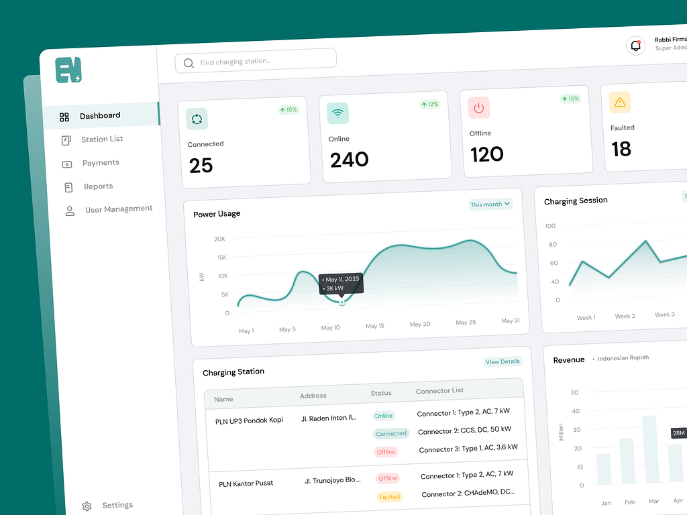
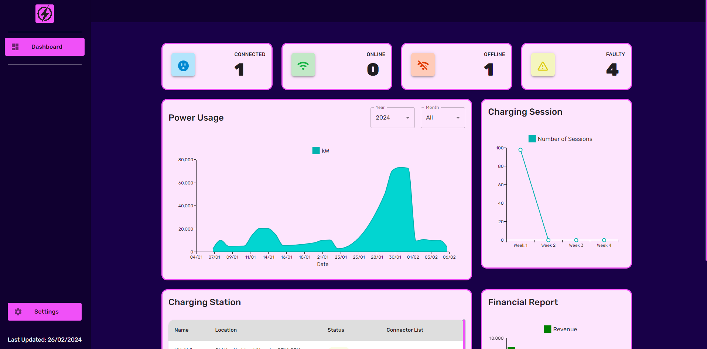
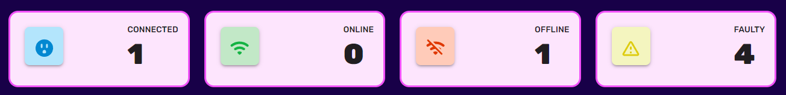
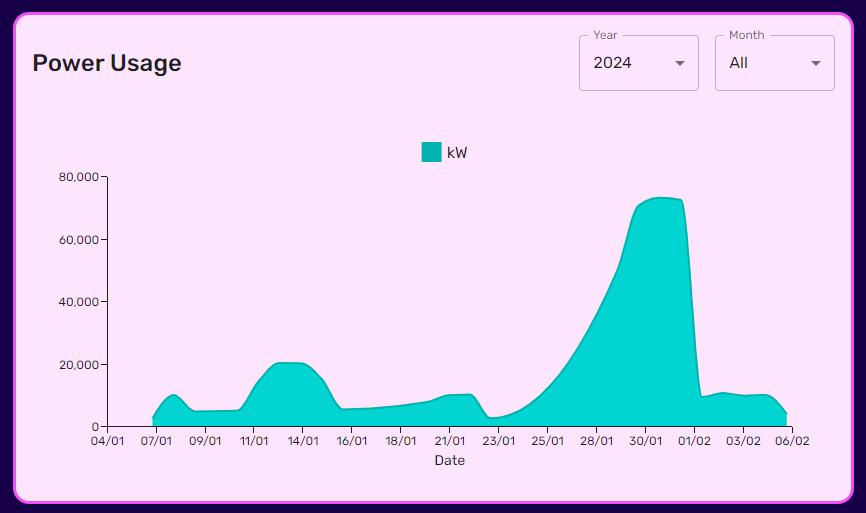
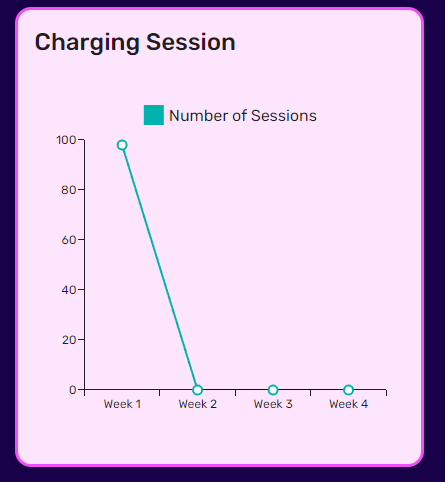
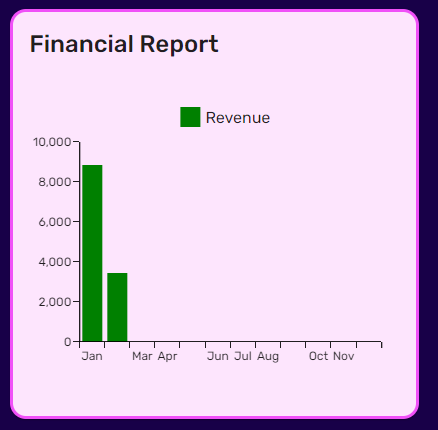
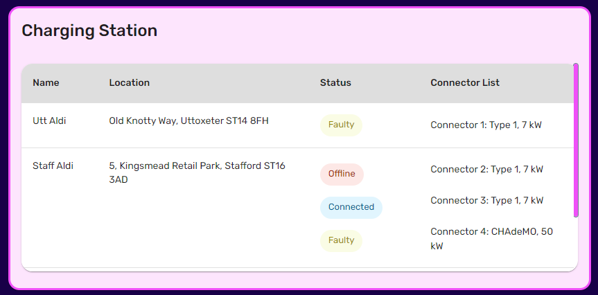

# EV Network Manager

---
## Contents
- [About this project](#about-this-project)
- [What To Expect](#what-to-expect)
- [Final Comments](#some-final-comments)
- [Learnings](#things-i-learned)
- [Disclaimer](#disclaimer)
---

## About this project
This project was created as a form of practice. But also because I saw this UI design whilst I was browsing dribbble for inspiration.

Here is the original UI Design from Robbie Firmansah:

### Stack

### Requirements
Core:
- [django](https://www.djangoproject.com/)
- [django-rest-framework](https://www.django-rest-framework.org/)
- [Faker](https://faker.readthedocs.io/en/master/)
- [React](https://react.dev/)

But of course check the [**requirements.txt**](./server/requirements.txt) and [**package.json**](./client/package.json) for more info...

If you wish to clone the project, don't forget to create a `.env` file in which you'll need to place your Django secret key, as well as your DB configuration parameters.

---
## What To Expect

You will be greeted by the main dashboard upon configuring the repository locally.

#### Components
**Statistics Cards** - show the status of the chargers across charging stations. 

**Power Usage** - shows the total power usage from all stations/chargers across the existing timeframe from the data.

**Charging Session** - shows the number of sessions happening on weekly basis (I believe the image is for the month of February).

**Financial Report** - a basic revenue/cost chart to show the total financials of the chargers/stations

**Charging Stations** - table showing the sites with chargers, their status and the type of chargers that are there.

---

## Some Final Comments
I understand that it's still not perfect, and there is still much to do, but it was a nice challenge to create something that I thought was an interesting idea.

Here are some things that could be better or should have been implemented already (or may be on the way:
- Change the Date filtering on the graphs.
- Add Rev/Cost Selection to Financial Report
- User authentication
- User should be able to add a station.
- TESTS, TESTS, TESTS. I need to start adding testing and more error handling blocks.

Here are some things that could also be implemented as future features:
- Add ability to read-in from CSV or other external file formats => import into database

---

## Things I learned
1. Management Commands in Django - I had to create scripts in order to fill my database with artificial data, which
was also happened to be a good time to get to grips with Django's built-in management commands system.
2. More detailed API processes - Connecting two popular frameworks was a great opportunity to learn more about API architecture,
and how to implement such a process across a full-stack application.
3. AWS Relational Database Service - I had recently learned about AWS RDS on a non-related venture, and decided that this
was a perfect opportunity to get hands-on experience with the service.
4. Material UI X Charts - This was the first time I have properly looked into and used the MUI-X library. Although it was
confusing at first, the documentation is helpful, and it is constantly updated.
5. MUI Theming - This is also one of the first instances where I have fully adopted theming, and tried my best to understand
the process and best practices.

---

## Disclaimer
Data used for this task is all artificial, in no way shape or form does any data represent real people, events, vehicles or incidents. Although location data is real, these were randomly generated for people in the data and therefore don't reflect reality.

Also, I would like to again mention the usefulness of [Robbi Firmansah's](https://dribbble.com/robbif_) design as it helped inspire the project.